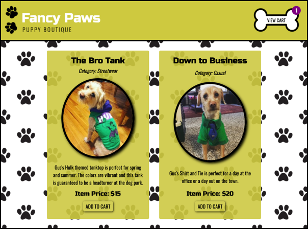
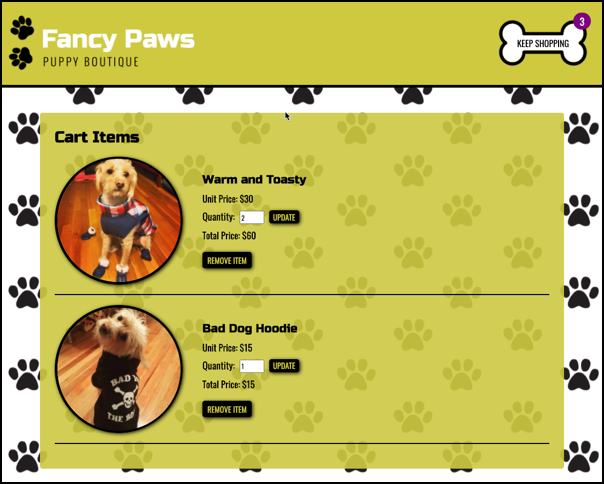

# Fancy Paws Puppy Boutique

## Description

A group project for [Grand Circus](https://www.grandcircus.co/bootcamps/) Front-End Bootcamp. Fancy Paws Puppy Botique is a point of sale system where dog owners can shop online for clothing items for their beloved pups.

## User Story

As a dog owner, I want a quick and easy way to purchase fancy clothing for my pet online so that I don't have to leave the comfort of my home.

## Technologies Used

- HTML
- CSS
- Google Fonts
- Shutterstock
- JavaScript

## Link to Deployed Application

<https://megancarnaghi.github.io/Thunderous-Thunderbirds-Point-of-Sales-System/>

## Screenshots

## Collaborators

- [Kayla Thomas](https://github.com/KaylaLT)
- [Kate Mora Woods](https://github.com/bailandocubita)
- [Megan Carnaghi](https://github.com/MeganCarnaghi)
